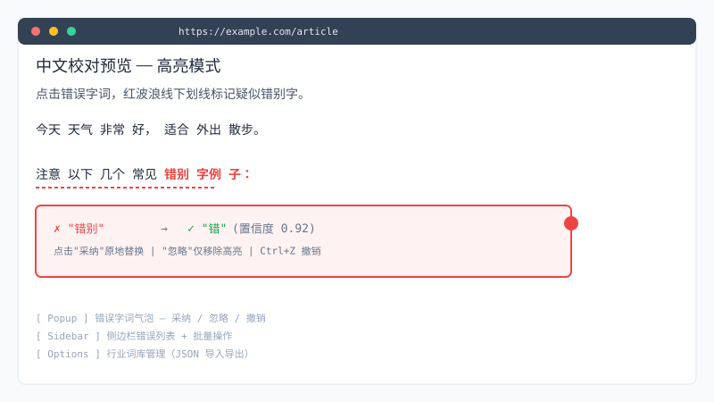

<div align="center">

# 📖 中文校对助手 · Chinese Proofread

> 浏览器本地 AI 中文长文智能校对 — **离线运行**，**隐私保护**

[](https://github.com/gandli/chinese-proofread/releases)
[](https://github.com/gandli/chinese-proofread/actions)

**[📥 下载 Release](https://github.com/gandli/chinese-proofread/releases/latest)** · **[报告问题](https://github.com/gandli/chinese-proofread/issues)** · **[贡献指南](CONTRIBUTING.md)** · **[使用手册](docs/USER_GUIDE.md)**

</div>

---

## ✨ 核心特性

<p align="center">
  
</p>

<table>
<tr>
<td width="50%">

**🔒 完全离线**
正文和校对结果不上传任何服务器，断网也能工作。

**🧠 智能校对**
MacBERT4CSC Q8 模型本地推理，字符级错别字检测。

**🎯 非侵入式**
CSS Custom Highlights 高亮，不污染页面 DOM。

</td>
<td width="50%">

**↩️ 撤销重做**
多级撤销栈 + Ctrl+Z/Y 快捷键，误操作无忧。

**📋 侧边栏总览**
Side Panel 错误列表 + 跳转定位 + 批量操作。

**📚 行业词库**
烟草/医疗/法律/金融/科技五域，JSON 导入导出。

</td>
</tr>
</table>

---

## 📸 预览

<p align="center">
  
</p>

---

## 🚀 快速开始

### 开发调试

```bash
bun install
bun run setup:model   # 下载模型到 public/models/ (114MB)
bun dev
```

浏览器加载扩展：`chrome://extensions/` → 开发者模式 → 加载已解压 → 选 `.output/chrome-mv3`。

### 构建

```bash
bun run setup:model
bun run build
# 输出：.output/chrome-mv3 可直接打包安装
```

### 测试与检查

```bash
bun run test       # 单元测试 (vitest, 41 用例)
bun run test:e2e   # 端到端 (Playwright 加载真实扩展)
bun run compile    # 类型检查 (tsc --noEmit)
bun run lint       # ESLint
```

---

## 🏗️ 工作原理

```text
浏览器网页
      │
      ▼
 Content Script (提取正文)
      │
      ▼
  Mozilla Readability 正文提取
      │
      ▼
  分句 + 滑动窗口分段
      │
      ▼
  WebGPU (优先) ↔ WASM (fallback)
      │
      ▼
  本地 ONNX 模型 (MacBERT4CSC Q8 量化)
      │
      ▼
  结果高亮 diff + popup 展示
```

---

## 🧠 引擎路线

双层演进：轻量模型快速扫描 → 大型 LLM 复杂校对。

| 阶段 | 模型 | 大小 | 任务 |
|------|------|------|------|
| **① 当前** | MacBERT4CSC (Q8) | 114 MB | 字符级快速错别字检测 |
| **② 规划** | ChineseErrorCorrector-1.5B (Q4) | ~900 MB | 复杂语法/上下文纠错 |
| **③ 愿景** | ChineseErrorCorrector4-4B | — | 高质量效果旗舰 |

---

## 📦 模型下载

当前内置 MacBERT4CSC（Q8 量化，452MB → 114MB，精度无损）：

```bash
bun run setup:model
```

下载到 `public/models/`：

```text
public/models/
  ├── model_quantized.onnx
  └── vocab.txt
```

模型来源：[gandli/macbert4csc-base-chinese-q8-onnx](https://huggingface.co/gandli/macbert4csc-base-chinese-q8-onnx)

---

## 📄 许可证

Apache-2.0（LICENSE 文件补充中）
