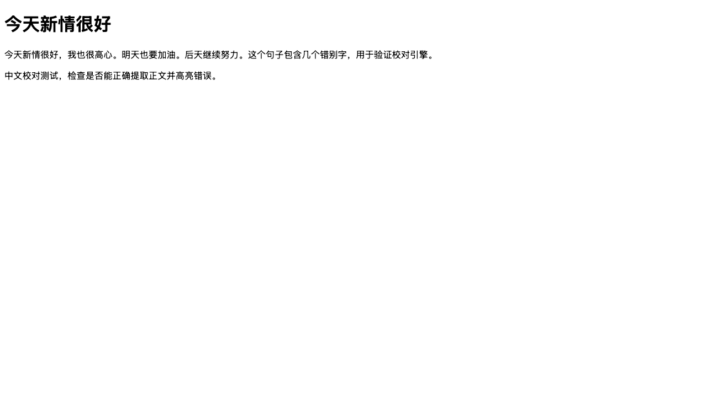
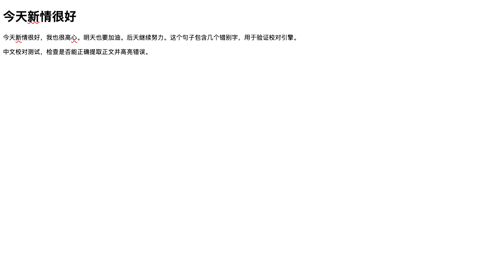

# chinese-proofread 使用手册

> 浏览器本地 AI 中文长文智能校对 — 离线可用，隐私保护

本手册由 **Playwright 全流程测试 + AI 编写**生成，截图与软件当前版本同步。

## 目录

- [安装](#安装)
- [快速开始](#快速开始)
- [核心事务：校对网页](#核心事务校对网页)
- [处理校对结果](#处理校对结果)
- [页面高亮标记](#页面高亮标记)
- [隐私与数据](#隐私与数据)
- [常见问题](#常见问题)

---

## 安装

### 环境要求

| 项 | 要求 |
|----|------|
| 浏览器 | Chrome / Edge（基于 Chromium） |
| 构建工具 | Bun ≥ 1.2（`bun --version` 检查） |
| 模型 | 首次使用需下载 114MB（一次性） |

### 构建扩展

```bash
git clone git@github.com:gandli/chinese-proofread.git
cd chinese-proofread
bun install
bun run setup:model   # 下载模型到 public/models/（114MB）
bun build
```

### 加载扩展

1. 打开 `chrome://extensions/`
2. 右上角开启「开发者模式」
3. 点击「加载已解压的扩展程序」
4. 选择 `chinese-proofread/.output/chrome-mv3` 目录

扩展图标会出现在工具栏。

---

## 快速开始

点击工具栏的中文校对助手图标，弹出面板：


面板顶部显示扩展名与「本地引擎 · 离线可用」状态。点击「校对当前页面」按钮即开始。

> 💡 首次使用会加载 114MB 模型，需等待几秒。之后模型常驻，校对即时响应。

---

## 核心事务：校对网页

在任意含长文章的网页上，点击扩展图标 → 点击「校对当前页面」：

**① 原文页面**

以测试页为例，包含若干错别字（「新情」「高心」）：



**② 校对过程**

扩展会：提取正文 → 本地模型推理 → 在原文中标出疑似错误。全程本地完成，页面内容不上传。


**③ 校对结果**

校对完成后，页面中疑似错误字词直接显示 **红色波浪线**，popup 面板显示统计摘要：


---

## 处理校对结果

**点击页面中的红色波浪线**，在原地弹出修正气泡：

气泡显示：
- **修正建议**：原词 → 修正词
- **置信度**：模型对该修正的把握程度

两个操作：

| 按钮 | 行为 |
|------|------|
| **采用** | 采纳该修正，页面文字原地替换，波浪线消失 |
| **忽略** | 关闭气泡，保持原样，波浪线保留 |

全部采用后，popup 状态变为「全部已修正 ✓」：


> 💡 popup 面板仅显示进度与统计，**不再包含列表**——所有交互在页面原地完成，体验更流畅。

---

## 页面高亮标记

校对完成后，错误在原网页中自动标出 **红色波浪线**。将鼠标悬停可查看修正建议：



> ⚠️ 置信度低（< 70%）的修正可能不准确，建议人工判断。

---

## 隐私与数据

- 🔒 正文和校对结果**不上传任何服务器**
- 📴 模型加载后**断网也能校对**
- 🔑 无需注册、无需账号
- 💾 文字全程留在浏览器内

---

## 常见问题

### 首次点击没反应 / 提示加载模型

首次需要下载 114MB 模型，请耐心等待。若长期卡住，检查网络后重试。

### 长文章只校对了一部分？

扩展自动将长文分段校对（单段上限 510 字），分段间保留重叠上下文，结果会合并展示，无需手动处理。

### 浏览器不支持 WebGPU？

引擎在 popup 中以 WASM 运行，不依赖 WebGPU，兼容性更好，仅速度稍慢。

### 校对结果不可用？

确保加载的是 `bun build` 产物（`.output/chrome-mv3`），且已运行 `bun run setup:model` 下载模型。

---

*手册截图由 Playwright 全流程测试自动生成（`bun run test:screenshots`），与软件版本同步。*